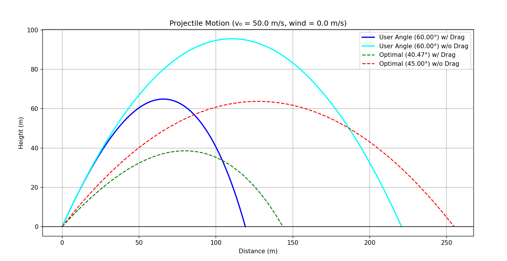

# AeroLaunch — Projectile Motion Optimizer: Beyond the Ideal Vacuum

[](https://colab.research.google.com/drive/1NVpikPbBux1LW-qtTFqP8v4wTAZWXnAg?usp=sharing)
**← Interactive dashboard — runs in your browser, no installation needed**

---

## Project Goal

High school physics assumes projectile motion happens in a perfect vacuum — no air resistance, no wind, and always 45° for maximum range. AeroLaunch breaks that assumption by simulating a real projectile moving through the atmosphere.

Two numerical methods are provided for comparison:

| Method | Accuracy | Optimizer |
|---|---|---|
| Euler (1st order) | O(Δt) global error | `scipy.optimize.minimize_scalar` |
| RK4 (4th order) | O(Δt⁴) global error | `scipy.optimize.minimize_scalar` |

---

## How the Physics Works

### Forces Acting on the Projectile

In a vacuum, only gravity acts on the projectile:

$$\frac{dv_y}{dt} = -g$$

In the atmosphere, a quadratic drag force opposes motion:

$$\mathbf{F}_d = -\frac{1}{2}\ \rho(y)\ C_d\ A\ |\mathbf{v}_{rel}|\ \mathbf{v}_{rel}$$

This gives the coupled acceleration equations:

$$a_x = -\frac{\rho(y)\ C_d\ A}{2m}\ |\mathbf{v}_{rel}|\ v_{rel x}$$

$$a_y = -g - \frac{\rho(y)\ C_d\ A}{2m}\ |\mathbf{v}_{rel}|\ v_{rel y}$$

Because $|\mathbf{v}_{rel}|$ mixes both velocity components, $a_x$ and $a_y$ are **coupled** — they cannot be solved independently, which is why a numerical method is required.

### Wind Model

Horizontal wind enters through the air-relative velocity:

$$v_{rel x} = v_x + v_w \qquad v_{rel y} = v_y$$

$$|\mathbf{v}_{rel}| = \sqrt{v_{rel x}^2 + v_{rel y}^2}$$

Positive $v_w$ = headwind (opposing motion). Negative $v_w$ = tailwind.

> Wind only affects the trajectory through the drag force. In drag-free mode, wind has no effect — which is physically correct.

### Altitude-Dependent Air Density

Instead of a constant sea-level density, air density decreases with altitude using the Barometric Formula:

$$\rho(y) = \rho_0 \cdot e^{-\frac{M\ g\ y}{R\ T}}$$

| Parameter | Value | Description |
|---|---|---|
| $\rho_0$ | 1.225 kg/m³ | Sea-level air density |
| $M$ | 0.029 kg/mol | Molar mass of air |
| $R$ | 8.314 J/(mol·K) | Universal gas constant |
| $T$ | 288.15 K | Standard sea-level temperature |

---

## Numerical Methods

### Euler Method

First-order integration. At each time step Δt:

$$v_{new} = v_{old} + a(v_{old}) \cdot \Delta t$$
$$x_{new} = x_{old} + v_{new} \cdot \Delta t$$

Simple and transparent, but error accumulates as O(Δt) per step.

### Fourth-Order Runge-Kutta (RK4)

Evaluates the acceleration function 4 times per step at the current point, two midpoints, and the full step ahead. Blends them with weights [1, 2, 2, 1]:

$$\Delta v = \frac{\Delta t}{6}(k_1 + 2k_2 + 2k_3 + k_4)$$

Fourth-order accuracy means the error is O(Δt⁴) — significantly more accurate per step than Euler, and stable at larger time steps.

### Angle Optimiser

Both methods use `scipy.optimize.minimize_scalar` (Brent's method) to find the exact range-maximising launch angle. This replaces the earlier brute-force 0.5° sweep and finds the optimal angle to 4+ decimal places, eliminating angular resolution artifacts.

---

## Simulation Parameters

| Parameter | Value |
|---|---|
| Gravitational acceleration $g$ | 9.81 m/s² |
| Sea-level air density $\rho_0$ | 1.225 kg/m³ |
| Drag coefficient $C_d$ | 0.47 (sphere) |
| Projectile radius $r$ | 0.05 m |
| Cross-sectional area $A$ | $\pi r^2 \approx 7.85 \times 10^{-3}$ m² |
| Mass $m$ | 0.5 kg |
| Time step $\Delta t$ | 0.001 s |

---

## Installation and Usage

### Requirements

```
Python 3.x
numpy
matplotlib
scipy
```

Install dependencies:

```bash
pip install numpy matplotlib scipy
```

### Running locally

```bash
python main.py
```

You will be prompted to:
1. Choose method: `1` for Euler, `2` for RK4
2. Enter initial velocity (m/s)
3. Enter launch angle (degrees)
4. Enter wind speed (m/s) — positive for headwind, negative for tailwind

### Running in browser

Click the **Open in Colab** badge at the top of this README. No installation needed.

---

## Sample Output

```
Projectile Motion Simulator
-----------------------------
1. Euler Method
2. RK4 Method

Choose numerical method (1 or 2): 2
Enter Initial Velocity (m/s): 50
Enter Launch Angle (degrees): 45
Enter Wind Speed (positive = headwind, negative = tailwind): 0

Using: RK4 Method

--- Results ---
[With Drag]    User 45.0° → 142.22 m | Optimal 40.47° → 143.52 m
[Without Drag] User 45.0° → 254.88 m | Optimal 45.00° → 254.88 m
```

---

## Key Findings

- With quadratic drag, the optimal launch angle shifts from **45° → 40.47°**
- Horizontal range is reduced by **~43.7%** relative to the vacuum prediction at the optimal angle
- Altitude-dependent density (barometric formula) slightly increases range relative to constant-density models — less drag near the apex
- Headwinds shift the optimal angle further below 45°; tailwinds shift it upward toward 45°
- The projectile (m = 0.5 kg, r = 0.05 m) operates in a **high-drag regime** — drag force at launch (≈5.66 N) exceeds its weight (≈4.90 N), which accounts for the large range reduction

---

## Project Structure

```
AeroLaunch/
├── main.py                               # Main program (Euler + RK4)
├── AeroLaunch_with_Interactive_Dashboard.ipynb  # Colab notebook with dashboard
├── graph_output.png                      # Sample output graph
└── README.md
```

---

## Potential Upgrades

- **Variable Initial Height** — adjust the y-axis equations to allow launch from an elevated position
- **Magnus Effect** — model how the spin of a ball creates lift, affecting trajectory
- **3D Motion** — extend equations to include lateral wind and cross-range displacement
- **Dynamic Drag Coefficient** — model $C_d$ as a function of Reynolds number $Re = \frac{\rho\ |\mathbf{v}_{rel}|\ D}{\mu}$

---

## AI Usage

During development, a generative AI assistant was used as a coding aid for debugging, implementing the Matplotlib visualisation, and guidance on translating the physics equations into code. All code was manually reviewed and tested against standard kinematic equations. No-drag results were verified against the analytical vacuum solution $R = v_0^2/g$.

---

## License

MIT License — see `LICENSE` for details.
